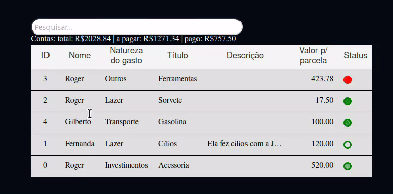

# *Esmeralda* 💹
<div style="
  background-color: #777;
  ">
  
</div>

#### O propósito da Esmeralda é ser um software de controle financeiro pessoal, ajudando a controlar os gastos e o dinheiro, sabendo para onde vai o dinheiro, quanto se pode gastar, quem fez a dívida e o total daquela dívida.

## Sumário:
  1.    [Detalhes](#details)
  2.    [Features](./features.md)
  3.    [Licença](./LICENSE) 
  4.    [Passo a passo para usar](#how-use)
  5.    [Imagens](#images)
  6.    [Créditos](#credits)

## *Detalhes*: <section id="details"/>

### *Versão* 🤖
`v0.1.6`


### Features
[ → Veja as mudanças aqui ←](./features.md) 

### Segurança
Confira [aqui](./SECURITY.md) quais versões tem suporte e como relatar um problema encontrado.  

### *Licença* 📜
O Software está submetido ao licenciamento [GNU Affero General Public License v3.0](./LICENSE).

## Como usar? <section id="how-use"/>

O aplicativo esta disponível para os sistemas operacionais listados a baixo:
<div style = "display: flex; margin: auto; width: 200px; font-size: larger;">

|Sistema <br> operacional|Versão <br> Disponível|
|-------------------|----------|
|Windows 10         |  0.1.5+  |
|Linux              |  0.1.*   |
|MacOs              |    ❌    |

</div>

### Instalação:

### Como instalar no Windows 10

#### Passo 1 - Baixe o instalador disponível [Aqui](https://github.com/EduLMoraes/Esmeralda/releases/download/v0.1.6/Esmeralda_installer-v0.1.6.exe) ou em [releases](https://github.com/EduLMoraes/Esmeralda/releases/)

#### Passo 2 - Rode o instalador, por falta de assinatura o windows pode pedir  confirmação para executar o programa, basta clicar em `saiba mais > executar mesmo assim`.

#### Passo 3 - Ao finalizar a instalação, rode o atalho que deve ter sido gerado na área de trabalho.

---

### Como instalar no Linux
#### Passo 1 - Baixe o executável do esmeralda aqui [Linux](https://github.com/EduLMoraes/Esmeralda/releases/download/v0.1.5/esmeralda)

#### Passo 2 - Rode estes comandos:
```bash
  sudo apt install postgresql
  sudo psql -U postgres -c "ALTER USER postgres WITH PASSWORD 'postgres';"
  wget -O construct_db.sql https://raw.githubusercontent.com/EduLMoraes/Esmeralda/main/src/Model/SQL/construct_db.sql
  sudo -u postgres psql -f construct_db.sql
```

---
#### 3 - Usando
  3.1 - Agora com tudo baixado e configurado, basta rodar ele, ir na tela de cadastro e criar seu login, logar e seguir usando-o normalmente, como mostrado em [imagens](#images)

---

## *Imagens* 📷 <section id = "images" />


### *Login*
A tela de login será a primeira tela a ser vista ao abrir o programa,
ela poderá te redirecionar para a tela de cadastro caso não haja conta
ou para a principal quando realizar o login.
### *Cadastro*
A tela de cadastro te permite criar uma conta, caso tente cadastrar uma
conta já existente, ela acusará falha no cadastro, do contrário, ela 
devolverá uma mensagem de sucesso e te pedirá para ir para a tela de login.

___
### *Homepage || Página principal*
Aqui é onde a mágica acontece.
 ### Adicionando conta.
  
  Ao adicionar uma conta ela aparecerá na lista à direita da tela
  e um resumo dos Devedores aparecerão na lista à esquerda.

  
 
 ___

 ### Pagando conta.

  Ao pagar uma conta, ele contabilizará uma parcela paga por vez, ao
  pagar todas as parcelas ela será dada como paga e o status mudará
  para positivo, significando que a conta está paga, isso reduzirá
  o valor total de dívida do devedor correspondente.

 
 ___

 ### Selecionando as colunas que deseja exibir.
  Por padrão as colunas exibidas são ID, Nome, Título, Data final, 
  Valor p/ parcela e Status, porém, é possível mudar isto selecionando
  as que deseja que sejam exibidas ou não na tabela à esquerda da tela,
  com exceção do ID.

 
 ___

 ### Editando conta.
  Apenas ao editar é possível adicionar uma descrição à uma conta,
  quase todas as colunas são editáveis, com exceção do ID e status.


 ____

 ### Ordenando a tabela segundo a coluna clicada.
  Ao clicar no cabeçalho de uma coluna você a ordenará de forma
  crescente, decrescente ou alfabeticamente. Para inverter a ordenação
  basta clicar novamente.


______

 ### Pesquisando conta.
  É possível pesquisar uma conta específica desde que tenha-se 
  conhecimento de algum atributo como Título, Nome, Natureza, ID,
  Descrição ou data, tanto final como inicial.



______


### *Como contribuir com o projeto*
Para contribuir com o projeto basta ler a documentação em [/doc](./doc/) e clonar o projeto com a seguinte linha
```git
git clone "https://github.com/EduLMoraes/Esmeralda.git"
```
E usar um repositório em seu github, ao finalizar as mudanças feitas por
ti, basta criar um pull request *(PR)* descrevendo o que foi modificado,
porquê foi modificado.

`Em caso de nova funcionalidade, documente-a e crie teste automatizado, se possível.`

Você pode rodar o projeto (necessário rust instalado) usando:
```bash
make run
```
ou
```bash
cargo run
```


### *Contribuidores*: <section id="credits"/>
<table>
  <tr>
     <td align="center"><a href="https://github.com/EduardoMoreaes"><br /><sub><b>Eduardo Lopes de Moraes</b></sub></a><br /><a href="https://github.com/EduardoMoreaes" title="Desenvolvedor">👨‍🚀</a></td>
  </tr>
<table>
