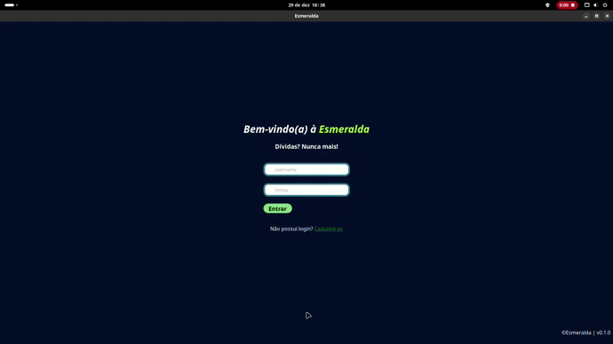
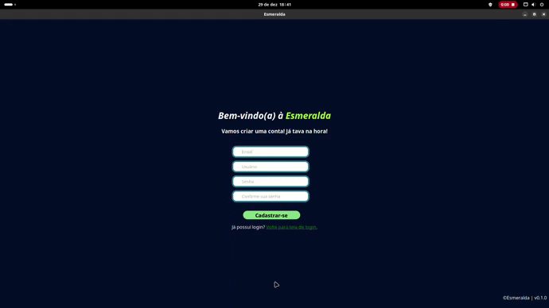
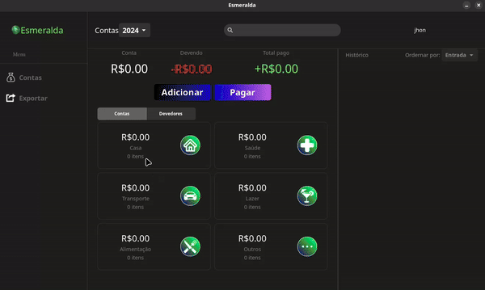
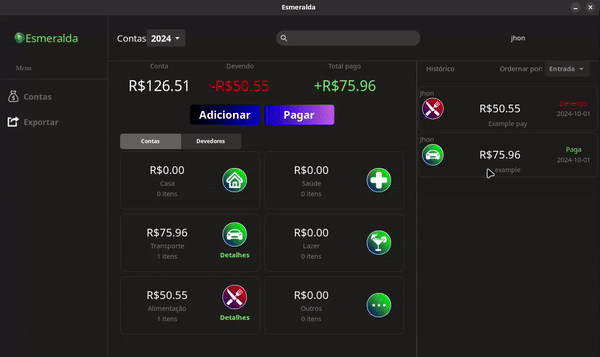
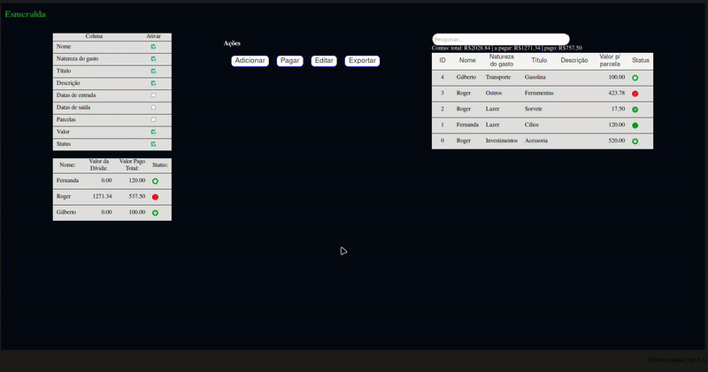
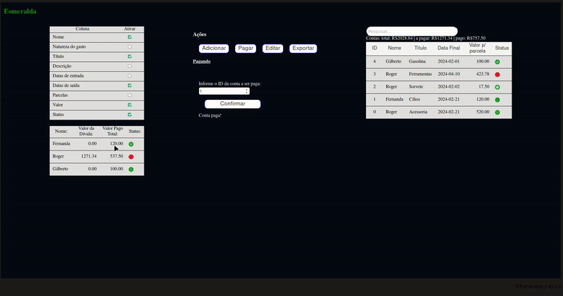
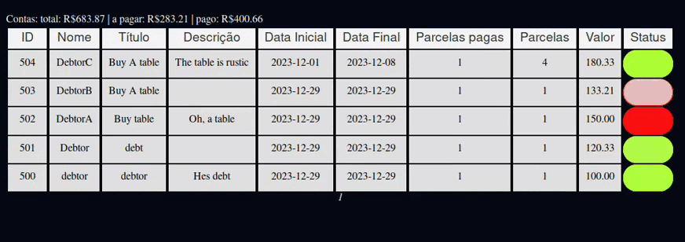

# *Esmeralda* 💹
O propósito da Esmeralda é ajudar a controlar os gastos e o dinheiro,
sabendo para onde vai o dinheiro, quanto se pode gastar, quem fez a
dívida e o total daquela dívida.

## *Versão* 🤖
`v0.1.0`

## *Licença* 📜
O Software está submetido ao licenciamento [GNU Affero General Public License v3.0](https://github.com/EduLMoraes/Esmeralda/blob/main/LICENSE).

## *Imagens* 📷

### *Icone*

___
### *Login*
A tela de login será a primeira tela a ser vista ao abrir o programa,
ela poderá te redirecionar para a tela de cadastro caso não haja conta
ou para a principal quando realizar o login.

___
### *Cadastro*
A tela de cadastro te permite criar uma conta, caso tente cadastrar uma
conta já existente, ela acusará falha no cadastro, do contrário, ela 
devolverá uma mensagem de sucesso e te pedirá para ir para a tela de login.

___
### *Homepage || Página principal*
Aqui é onde a mágica acontece.
 - Adicionando conta.

 ___
 - Pagando conta.

 ___
 - Editando conta.

 ___
 - Selecionando as colunas que deseja exibir.

 ___
 - Ordenando a tabela segundo a coluna clicada.

## *Detalhes*:

### *Total de Linhas*:
4574 linhas. Última contagem em 24/12/2023 - 15:58

### *Contribuidores*:
<table>
  <tr>
     <td align="center"><a href="https://github.com/EduardoMoreaes"> <b>Eduardo Moraes</b></a> <a href="https://github.com/EduardoMoreaes" title="Desenvolvedor">👨‍🚀</a></td>
  </tr>
<table>