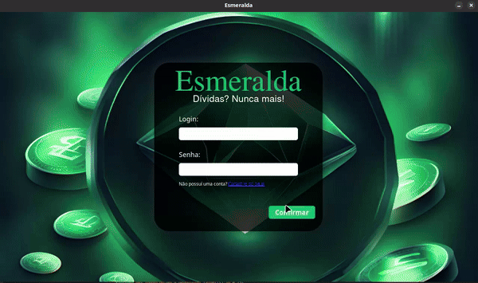

# *Esmeralda* 💹
O propósito da Esmeralda é ajudar a controlar os gastos e o dinheiro,
sabendo para onde vai o dinheiro, quanto se pode gastar, quem fez a
dívida e o total daquela dívida.

## Sumário:
  1.    [Detalhes](#details)
  2.    [Features](./features.md)
  3.    [Licença](./LICENSE) 
  4.    [Imagens](#images)
  5.    [Passo a passo para usar](#how-use)
  6.    [Créditos](#credits)

## *Detalhes*: <section id="details"/>

### *Versão* 🤖
`v0.1.5`


### Features
[ → Veja as mudanças aqui ←](./features.md) 

### Segurança
Confira [aqui](./SECURITY.md) quais versões tem suporte e como relatar um problema encontrado.  

### *Licença* 📜
O Software está submetido ao licenciamento [GNU Affero General Public License v3.0](./LICENSE).

## *Imagens* 📷 <section id = "images" />

### *Icone*

___
### *Login*
A tela de login será a primeira tela a ser vista ao abrir o programa,
ela poderá te redirecionar para a tela de cadastro caso não haja conta
ou para a principal quando realizar o login.

___
### *Cadastro*
A tela de cadastro te permite criar uma conta, caso tente cadastrar uma
conta já existente, ela acusará falha no cadastro, do contrário, ela 
devolverá uma mensagem de sucesso e te pedirá para ir para a tela de login.

___
### *Homepage || Página principal*
Aqui é onde a mágica acontece.
 - Adicionando conta.

 ___
 - Pagando conta.

 ___
 - Editando conta.

 ___
 - Selecionando as colunas que deseja exibir.

 ___
 - Ordenando a tabela segundo a coluna clicada.


<!-- 
## Como usar? <section id="how-use"/>
-->


 
 <!-- ---
#### 2 - Download do executável
  2.1 - Baixe o executável do esmeralda de acordo com o seu sistema operacional.
   
   - Download para [Windows 10 x86_64](https://github.com/EduLMoraes/Esmeralda/releases/download/v0.1.5/esmeralda.exe)
   - Download para [Linux - Manjaro](https://github.com/EduLMoraes/Esmeralda/releases/download/v0.1.5/esmeralda)

---
#### 3 - Usando
  3.1 - Agora com tudo baixado e configurado, basta rodar ele, ir na tela de cadastro e criar seu login, logar e seguir usando-o normalmente, como mostrado em [imagens](#images)

--- -->

### *Como contribuir com o projeto*
Para contribuir com o projeto basta clonar o projeto com a seguinte linha
```git
git clone "https://github.com/EduLMoraes/Esmeralda.git"
```
E usar um repositório em seu github, ao finalizar as mudanças feitas por
ti, basta criar um pull request *(PR)* descrevendo o que foi modificado,
porquê foi modificado.

`Em caso de nova funcionalidade, documente-a e crie teste automatizado, se possível.`

Você pode rodar o projeto (necessário rust instalado) usando:
```bash
make run
```
ou
```bash
cargo run
```


### *Contribuidores*: <section id="credits"/>
<table>
  <tr>
     <td align="center"><a href="https://github.com/EduardoMoreaes"><br /><sub><b>Eduardo Lopes de Moraes</b></sub></a><br /><a href="https://github.com/EduardoMoreaes" title="Desenvolvedor">👨‍🚀</a></td>
  </tr>
<table>
