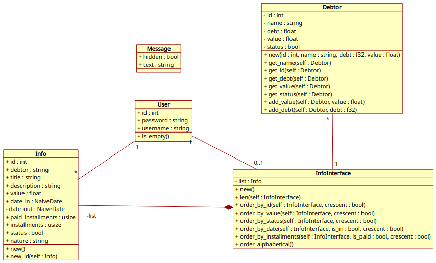
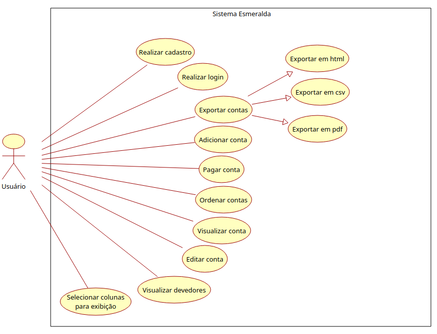

# Documentação gerada por rust:

Link para documentação:
 - https://esmeralda-docs.vercel.app/

<!-- ## Diagramas:
- Classe

- Caso de uso
 -->

## Requisitos
### v0.1.*
-----

✅ - Concluído |
❌ - Não Concluído |
⏳ - Em andamento

Requisitos Funcionais:
✅ 1 - Autenticação:

    · O sistema deve permitir o login de usuários com um nome de usuário e senha. ✅
    · Para cadastro, será solicitado um e-mail, senha, confirmação de senha e nome de usuário. ✅

✅ 2 - Controle de Gastos:

    · Mostrar na tela os gastos individuais por usuário, indicando o valor gasto e o status da dívida. ✅
    · Registrar e exibir a quantidade total de dinheiro gasto por usuário. ✅
    · Exibir o saldo disponível para gastos. ✅

✅ 3 - Compra Parcelada:

    · Para compras parceladas, o sistema deve mostrar o número da parcela atual e quantas foram pagas. ✅
    · Mostrar o valor pago até o momento das compras parceladas. ✅

✅ 4 - Exportação de Dados:

    · Permitir a exportação de dados em formato .csv. ✅
    · Os dados exportados devem incluir informações sobre gastos individuais, status da dívida, total gasto, e detalhes das compras parceladas. ✅

⏳ 5 - Conexão à Internet:

    · O sistema deve utilizar a internet para enviar e-mail de confirmação durante o processo de cadastro. ❌
    · O sistema deve utilizar a internet para enviar e-mail de recuperação de senha quando solicitado. ❌
    · Enviar dados apenas quando solicitado pelo usuário, utilizando a internet somente para essa finalidade. ❌

Requisitos Não Funcionais:

✅ 1 - Segurança:

    · Implementar criptografia para o sistema de login e para proteger dados sensíveis. ✅
    · Implementar instalador para o banco de dados, evitando senha padrão a todos os usuários. ✅

✅ 2 - Plataforma:

    · Desenvolver o sistema para a plataforma desktop. ✅

✅ 3 - Banco de Dados:

    · Utilizar Postgres como banco de dados para armazenamento dos dados do sistema. ✅

✅ 4 - Framework:

    · Desenvolver o sistema utilizando os frameworks Dioxus e Dioxus_desktop. ✅

✅ 5 - Desempenho:

    · Garantir agilidade no acesso e manipulação dos dados, considerando a natureza offline do sistema. ✅
---

### v1.*
1. Conectar com banco.
    - Em avaliação...

2. Exportação carnê leão.
    - Em avaliação...

3. Controle de metas.

4. Notificação.

5. Versão mobile.

6. Conexão com versão mobile.

7. Leitura de nota fiscal, via camêra do celular.
    - Automação com código de consulta improvável, pois as APIs disponíveis são monetizadas.

8. Criar/excluir grupos personalizados.

9. Rendimento mensal.

10. Calculadora IR.

11. Conversão de moedas.

12. Controle de investimentos.